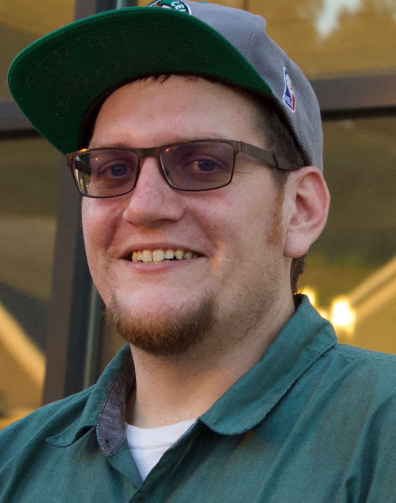

{::options parse_block_html="true" /}

### Francine E Garrett-Bakelman

Dr. Francine Garrett-Bakelman is a physician scientist who cares for patients with hematological malignancies and studies disease mechanisms in and biomarkers of Acute Myeloid Leukemia.

More about my work can be accessed from the [BMG faculy profile][FGB_facultyProfile] or [here][FGB_clincalProfile]

----

{::options parse_block_html="true" /}

### Yaseswini Neelamraju

I grew up in India and received bachelor’s degree in Biotechnology and a master’s degree in Bioinformatics. Immediately after graduation, I joined the lab of Dr. Sarath Chandra Janga at Indiana University Purdue University Indianapolis (IUPUI) as a research scholar and studied the role of RNA Binding Proteins in cancer. Later, I joined Dr. Francine Garrett-Bakelman as a computational biologist at Weill Cornell Medicine and continued to work with her at University of Virginia. I will be enrolling as a graduate student at the University of Virginia in 2018. On the professional front, I enjoy coding and learning new computational methods to address biological questions. My research interest is to develop and apply novel computational approaches to understand cancer biology. List of my publications can be accessed [here][YN_pubmed]
Outside of work , I enjoy reading books, listening to music and hiking!

----

{::options parse_block_html="true" /}

### Sam Haddox

I have been interested in molecular genetics and cancer research since I was 16 when my mother was diagnosed with multiple myeloma. After graduating from the technology Academy at Landstown Highschool, I  earned my bachelor’s degree at the University of Hawaii where I studied cellular/molecular biology and chemistry. As an undergrad student Research Assistant, I was lucky enough to gain invaluable experience at the USDA-ARS Pacific Basin Agricultural Research Center in Hilo, Hi working on drosophila proteomics/genomics and a project to adapt mammalian lentiviral vectors for use in drosophila fruit flies. After Graduating I came home to Virginia and worked at Eastern Virginia Medical School for 3 years as a Research Assistant in a lab studying diabetes and its associated cardiovascular complications. Which has all lead me to  Dr. Francine Garrett-Bakelman where I am the laboratory manager and senior laboratory technician.

List of my publications can be accessed [here][SH_pubmed]

----

### Emily Dennis

I received my undergraduate degree in biology with a history minor from the University of Virginia in 2017.  While a student, I volunteered in Dr. Charles Landen’s lab researching chemotherapy resistance in ovarian cancer. I joined Dr. Garrett-Bakelman’s laboratory in June 2017 and have been working on processing patient samples for downstream analyses aiming to understand mechanisms of disease in Acute Myeloid Leukemia patients.

----

### Subhash Prajapati

I grew up in New Delhi, India and received my Ph.D. in Biochemistry from the Department of Biochemistry, All India Institute of Medical Sciences, New Delhi under Professor (Dr.) Shyam S. Chauhan. Then, I moved to the USA for postdoctoral training in Epigenetics in Dr. Mark E. Kleinman’s laboratory at University of Kentucky, and played a leading role in elucidating epigenetic/metabolic regulation of physiological aging. With specific interest to investigate potential gene drivers causing aberrant cell phenotypes in acute myeloid leukemia (AML), I joined Dr. Francine E. Garrett-Bakelman’s laboratory at University of Virginia. Here I am leading functional studies to identify key genes driving AML relapse and chemotherapy resistance. My long-term career goal is to contribute to the current understanding of physiological aging and related pathologies, especially AML and develop effective therapies for their better management.

List of my publications can be accessed [here][SP_pubmed]

### Nicholas Dunham

I attended James Madison University for my Bachelor’s degree in Biotechnology. While at JMU, I worked with Dr. Raymond Enke on DNA methylation in the vertebrate retina. I enrolled into the graduate studies at the University of Virginia and joining the Garrett-Bakelman laboratory to perform thesis research on the roles of epigenetic modifications and mechanisms in acute myeloid leukemia.

<!-- Pubmed Links in alphabetical order -->
[FGB_pubmed]: https://www.ncbi.nlm.nih.gov/sites/myncbi/francine.garrett-bakelman.1/bibliography/43682539/public/?sort=date&direction=ascending
[FGB_facultyProfile]:https://bmg.med.virginia.edu/faculty-research-interests/?id=28797
[FGB_clincalProfile]:https://uvahealth.com/findadoctor/profile/francine-e-garrett-bakelman
[SH_pubmed]: https://www.ncbi.nlm.nih.gov/pubmed/?term=haddox%2C+sam
[SP_pubmed]: https://www.ncbi.nlm.nih.gov/pubmed/?term=prajapati%2C+subhash
[YN_pubmed]: https://www.ncbi.nlm.nih.gov/pubmed/?term=neelamraju%2C+yaseswini

